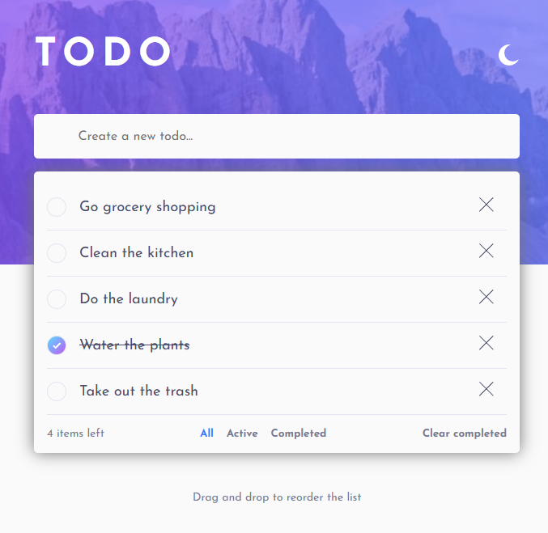
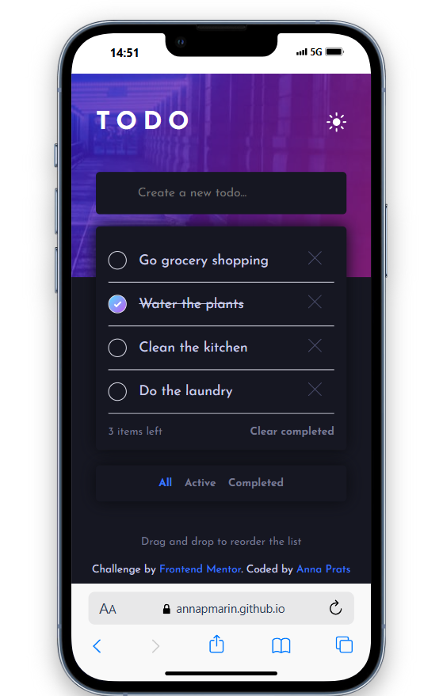

# Frontend Mentor - Todo app solution

This is a solution to the [Todo app challenge on Frontend Mentor](https://www.frontendmentor.io/challenges/todo-app-Su1_KokOW). Frontend Mentor challenges help you improve your coding skills by building realistic projects. 

## Table of contents

- [Overview](#overview)
  - [The challenge](#the-challenge)
  - [Screenshot](#screenshot)
  - [Links](#links)
- [My process](#my-process)
  - [Built with](#built-with)
  - [What I learned](#what-i-learned)
  - [Continued development](#continued-development)
  - [Useful resources](#useful-resources)
- [Author](#author)

## Overview

### The challenge

Users should be able to:

- View the optimal layout for the app depending on their device's screen size
- See hover states for all interactive elements on the page
- Add new todos to the list
- Mark todos as complete
- Delete todos from the list
- Filter by all/active/complete todos
- Clear all completed todos
- Toggle light and dark mode
- **Bonus**: Drag and drop to reorder items on the list
- **Bonus**: Todos are persisted in localStorage so your session is saved even if you refresh or close the browser (not required in the original challenge)

### Screenshot

### Links

- Solution URL: [https://github.com/annapmarin/todo-app/](https://github.com/annapmarin/todo-app/)
- Live Site URL: [https://annapmarin.github.io/todo-app/](https://annapmarin.github.io/todo-app/)

## My process

I started by setting up the project with Vite and React, then structured the components and context for state management. I implemented the core features first (add, toggle, delete, filter todos), followed by the drag-and-drop functionality using `@hello-pangea/dnd`. I also added theme toggling and ensured the UI was responsive and accessible. Finally, I persisted todos in localStorage for a better user experience.

### Built with

- [React 19](https://react.dev/)
- [TypeScript](https://www.typescriptlang.org/)
- [Vite](https://vitejs.dev/)
- [@hello-pangea/dnd](https://github.com/hello-pangea/dnd) (for drag and drop)
- CSS Modules

### What I learned

- How to manage global state in React using Context and custom hooks.
- Implementing drag-and-drop with `@hello-pangea/dnd`.
- Persisting state in localStorage for session continuity.
- Responsive design with CSS and custom properties for theming.
- Writing unit tests for logic using Jest and TypeScript.

### Continued development

- Allow editing of existing todos.
- Add some CSS transitions when changing states.

### Useful resources

- [Frontend Mentor Challenge](https://www.frontendmentor.io/challenges/todo-app-Su1_KokOW)
- [React Context Docs](https://react.dev/reference/react/createContext)
- [@hello-pangea/dnd Docs](https://github.com/hello-pangea/dnd)

## Author

- Website - [Anna Prats](https://www.annaprats.dev)
- Frontend Mentor - [@annapmarin](https://www.frontendmentor.io/profile/annapmarin)